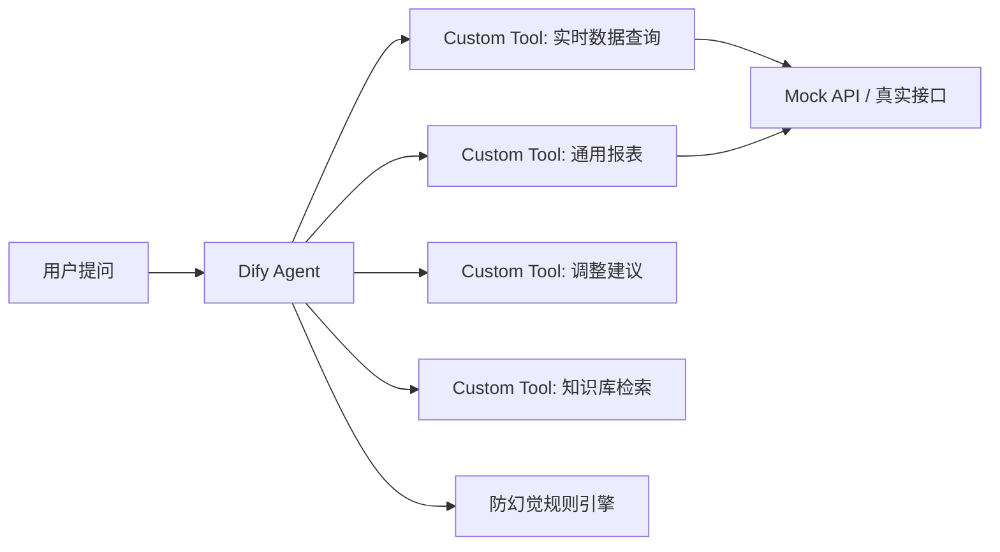

# dify-agent-playbook

> 从 0 到 1 搭建可私有化部署的 Dify 多工具 AI Agent（脱敏版）
> 背景：面向工业运维场景的 AI 智能问答系统——把分散的实时数据接口、业务系统与企业知识库统一为自然语言入口。

<!-- TODO: 替换为你的架构图（可用 mermaid，或放一张 PNG） -->


## 快速开始

```bash
# 1. 克隆仓库
git clone https://github.com/<你的用户名>/dify-agent-playbook.git
cd dify-agent-playbook

# 2. 启动 mock 数据接口（FastAPI）
cd mock-api
pip install -r requirements.txt
uvicorn main:app --port 8018

# 3. 启动 Dify（Docker Compose 一键起）
cd ..
docker compose up -d

# 4. 导入 prompt 模板 → 配置工具 → 开聊
```

## 目录结构

| 目录 | 内容 | 说明 |
|------|------|------|
| `tools/` | 4 个 Dify Custom Tool 的通用实现 | 展示“一行提示词接入新报表”的设计模式 |
| `prompts/` | 防幻觉提示词模板（脱敏版） | 30+ 轮迭代沉淀的方法论 |
| `mock-api/` | FastAPI 模拟数据接口 | 让仓库脱离真实环境也能跑通 |
| `docs/` | 架构设计与踩坑记录 | 工程素养展示 |

## 核心方法论

<!-- TODO: 补 2-3 条你最想讲的方法论，每条 3-5 行 -->
1. **防幻觉铁律**：工具调用前先验证参数 → 结果返回后要求模型引用来源 → 知识库检索加阈值过滤。
2. **工具设计模式**：新报表接入只需一行提示词（配置驱动，表头与测点全从配置动态读取）。
3. **性能优化**：批量 IN 查询 + 内存索引，SQL 调用 2700 次 → 4 次，响应 40s → 亚秒级。

## 许可证

MIT License
