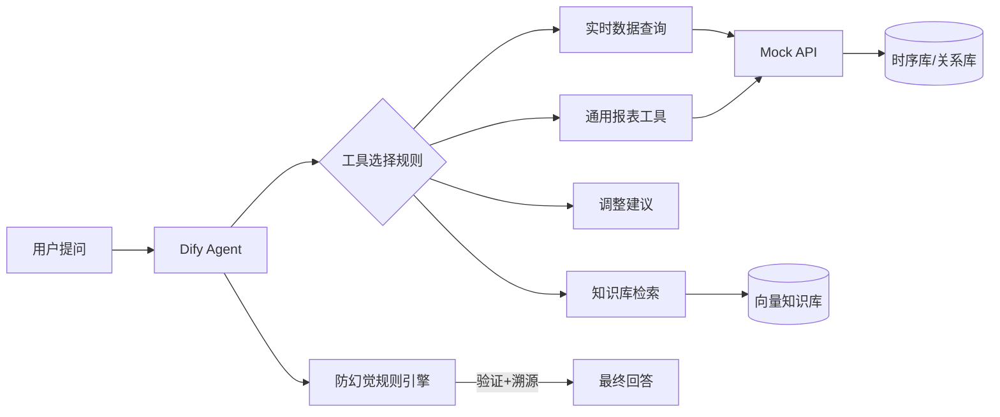

# engineering-delivery-playbook

> 从业务痛点 → 技术方案 → 现场交付：工业场景工程交付方法论、案例库与可复现代码骨架（脱敏版）

基于工业场景真实落地经验提炼的可复用方法论与代码骨架：AI 智能问答（Dify 多工具 Agent，30+ 轮提示词迭代、100+ 条测试用例）、存量报表性能改造、无人值守数据管道——把分散的实时数据接口、业务系统与企业知识库，统一为自然语言入口。

## 三大核心方法论（仓库的魂）

### 1. 防幻觉铁律（RAG 问答的命门）

AI 问答最怕"一本正经地胡说"。经过 30+ 轮提示词迭代，沉淀出 4 条铁律：

| 铁律 | 做法 | 解决的问题 |
|------|------|-----------|
| 工具选择规则 | 提示词中显式定义"什么问题必须调什么工具"，禁止模型自由发挥 | 模型拿报表数据回答实时查询 |
| 参数先验证后查询 | 工具调用前校验参数合法性（测点是否存在、时间范围是否越界） | 无效请求消耗模型上下文 |
| 结果强制引用来源 | 回答必须附带数据来源与时间戳，无法溯源则明说"无数据" | 编造指标数值 |
| 知识库检索阈值过滤 | 低于相似度阈值的检索结果直接丢弃 | 拿不相关内容硬答 |

### 2. Custom Tool 设计模式：一行提示词接入新报表

核心思想：**把"怎么查"写进配置，把"查什么"留给提示词**。

- 表头、测点、维度全部从配置动态读取（表头从 DB 动态加载）
- 抽象计算列模式（calcColMap）统一处理派生指标，运营侧新增指标**无需改代码**
- 效果：新报表接入只需在提示词里加一句话，单工具覆盖 20+ 业务报表

### 3. 取数性能优化：2700 次 SQL 调用 → 4 次

报表场景的经典性能陷阱：循环逐点查询。

- 原实现：每测点 × 每时段 逐条查询 → 最差 2700 次 SQL 调用，响应 40s
- 重构：批量 IN 查询 + 内存 Map 索引 → **4 次 SQL，响应亚秒级**
- 配套：统一接口规范（返回 `List<String[]>` 二维数组 + 中文表头），前端零适配

## 架构（脱敏版）



> 说明：真实系统中 Mock API 位置对接火优实时数据接口（HTTP 复用 7 个接口，零后端改造）；本仓库以 FastAPI Mock 替代，保证可复现。

## 目录结构

| 目录 | 内容 | 状态 |
|------|------|------|
| `tools/` | Custom Tool 通用实现（配置驱动 + 计算列模式，报表=YAML 零代码扩展） | ✅ 已实装 |
| `prompts/` | 防幻觉提示词资产库（4 条铁律方法论 + 3 份模板 + 静态校验器 validator.py） | ✅ 已实装 |
| `ai-collab/` | AI 协作治理体系（通用 4 角色 subagent + 人机边界红线 + 接入/审查 SOP + 一键接入脚本 + 泄漏扫描校验器） | ✅ 已实装 |
| `mock-api/` | FastAPI 模拟实时数据接口（测点/时序/报表 3 类 REST，含 N+1 vs 批量基准） | ✅ 已实装 |
| `docs/` | 架构设计、踩坑记录、案例库（Case Studies） | ✅ 已含案例 01-03 |
| 根目录 | `docker-compose.yml` 一键起环境 + `demo.sh` / `demo.ps1` 一键演示 | ✅ 已实装 |

## 快速开始（30 秒跑起来）

```bash
# 1. 克隆
git clone https://github.com/yang-shenxu/engineering-delivery-playbook.git
cd engineering-delivery-playbook

# 2. Docker 一键起 mock 数据接口（FastAPI :8018，自动健康检查）
docker compose up -d --build

# 3. 打开接口文档（Swagger UI，可直接点 Try it out）
open http://localhost:8018/docs

# 4. 一键演示：健康检查 / 测点 / 时序 / 报表（含 batch vs n1 性能对比）
./demo.sh            # Linux / macOS
./demo.ps1           # Windows PowerShell

# 5.（可选）全量自检：三件套测试一键跑绿
docker compose run --rm verify
```

> 💡 国内网络：构建加 `--build-arg PIP_INDEX_URL=https://pypi.tuna.tsinghua.edu.cn/simple` 走 PyPI 镜像。
> 💡 不想用 Docker？见 [mock-api/README.md](mock-api/README.md) 的本地 pip 方式（`uvicorn main:app --port 8018`）。
> 💡 停服务：`docker compose down`。

> ✅ 全部代码块已实装：mock-api / tools/report_tool / prompts / ai-collab 均可运行（见各子目录 README），docker-compose 一键起 + 一键演示 + 一键自检。Star 关注，持续更新。

## AI 协作：人和 AI 的分工怎么定

提示词解决"单次对话质量"（见 `prompts/`），[ai-collab/](ai-collab/) 解决"长期协作秩序"：

| 资产 | 一句话 |
|---|---|
| 通用 4 角色 | `@architect` / `@code-reviewer` / `@doc-keeper` / `@requirement-clarifier` 全局共享、跨项目零修改复用 |
| 人机边界红线 | AI 只做代码层：不打包、不部署、不执行 SQL、不确定必标"待确认"（7 条铁律） |
| 审查 SOP | 独立审查官七步流程 + 六维框架——写代码的 AI 不审查自己的代码 |
| 一键接入 | `bash ai-collab/scripts/install.sh <项目路径>` 15 分钟接入任意新项目 |
| 泄漏扫描 | `check_roles.py` 提交前自动拦截公司/项目信息进入公开仓库 |

## 案例库（Case Studies）

方法论不能只讲一遍——用真实战场故事证明它能落地：

| 案例 | 主题 | 链接 |
|---|---|---|
| 01 · 火电报表 N+1 查询优化 | 存量系统性能改造：四张老报表 SQL 从 ~3000 次/张降到 1~2 次，业务零改动 | [docs/case-studies/01-report-query-optimization.md](docs/case-studies/01-report-query-optimization.md) |
| 02 · 火电运维 AI 问答助手 | AI 产品从 0 到 1 + 内网无 GPU 约束下微主机现场私有化交付：工具收敛 16→4、提示词 30+ 轮、100+ 测试用例 | [docs/case-studies/02-xiaou-ai-assistant.md](docs/case-studies/02-xiaou-ai-assistant.md) |
| 03 · 煤质数据自动采集管道 | 双 FTP 异构数据源 → 时序库的无人值守 ETL：双编码/非标 LIST/复杂口径 5 重约束，2 天交付 + 零编码现场部署 | [docs/case-studies/03-coal-data-pipeline.md](docs/case-studies/03-coal-data-pipeline.md) |
| 04 · 计算引擎双写管道升级 | 计算结果旁路同步关系库：v1/v2 方案取舍、同源双容器、两层幂等（确定性 UUID + upsert）、异常隔离不反噬主链路 | [docs/case-studies/04-computing-dual-write.md](docs/case-studies/04-computing-dual-write.md) |

## 技术博客

方法论不只躺在仓库里——也写成面向社区的文章，欢迎交流：

| 文章 | 主题 | 链接 |
|---|---|---|
| 01 · 把 SQL 从 2700 次降到 4 次 | 存量报表 N+1 手术：批量 IN + 内存 Map 索引，业务零改动，附可复现 Demo | [blog/01-n1-to-batch-report-optimization.md](blog/01-n1-to-batch-report-optimization.md) |
| 02 · AI 问答不再"一本正经地胡说" | 30 轮提示词迭代沉淀的防幻觉 4 条铁律 + validator.py 静态校验器（把规则变成 CI 检查） | [blog/02-rag-anti-hallucination.md](blog/02-rag-anti-hallucination.md) |
| 03 · 我把 AI 助手管成一个 4 人团队 | 多项目实战沉淀的 AI 协作治理体系：三条原则 + 通用 4 角色 + 7 条人机边界红线 + 一键接入/泄漏扫描脚本 | [blog/03-ai-collab-4-roles.md](blog/03-ai-collab-4-roles.md) |
| 04 · Dify Custom Tool 设计模式 | 配置驱动的报表工具：一张报表=YAML、formula 白名单计算列、一行提示词接入新报表 | [blog/04-custom-tool-design-pattern.md](blog/04-custom-tool-design-pattern.md) |

## 脱敏声明

本仓库为**方法论与通用实现的脱敏重写版**，不含任何真实业务数据、企业代码或未公开接口信息。所有数据均为模拟占位，仅用于演示架构与方法。

## 路线图

- [x] mock-api：FastAPI 模拟接口（测点/时段/指标 3 类 REST 接口，含 N+1 vs 批量性能基准）
- [x] tools：通用报表工具完整实现（配置驱动 + 计算列，见 [tools/report_tool](tools/report_tool/README.md)）
- [x] prompts：防幻觉四铁律方法论 + 3 份模板 + validator.py 静态校验器（见 [prompts/README.md](prompts/README.md)）
- [x] ai-collab：AI 协作治理体系（通用 4 角色 + 红线 + SOP + install.sh + check_roles.py 泄漏扫描，见 [ai-collab/README.md](ai-collab/README.md)）
- [x] docker-compose：一键起 mock-api + verify 全量自检 + demo.sh / demo.ps1 一键演示
- [ ] 演示 GIF：实时查数 → 报表问答 → 知识库问答
- [x] 博客第 1 篇：《把 SQL 从 2700 次降到 4 次——存量报表的 N+1 手术》（见 [blog/01-n1-to-batch-report-optimization.md](blog/01-n1-to-batch-report-optimization.md)）
- [x] 博客第 2 篇：《AI 问答不再"一本正经地胡说"：30 轮提示词迭代沉淀 4 条防幻觉铁律》（见 [blog/02-rag-anti-hallucination.md](blog/02-rag-anti-hallucination.md)）
- [x] 博客第 3 篇：《我把 AI 助手管成一个 4 人团队：多项目实战沉淀的 AI 协作治理体系》（见 [blog/03-ai-collab-4-roles.md](blog/03-ai-collab-4-roles.md)）
- [x] 博客第 4 篇：《Dify Custom Tool 设计模式：一行提示词接入一张新报表》（见 [blog/04-custom-tool-design-pattern.md](blog/04-custom-tool-design-pattern.md)）

## 许可证

MIT License © 2026 yang-shenxu
