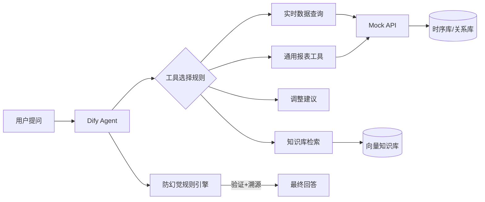

# dify-agent-playbook

> 一行提示词接入新报表：可私有化部署的 Dify 多工具 AI Agent 实战指南（脱敏版）

基于工业运维场景 AI 智能问答系统的真实落地经验（30+ 轮提示词迭代、100+ 条测试用例），提炼出可复用的方法论与代码骨架：把分散的实时数据接口、业务系统与企业知识库，统一为自然语言入口。

## 三大核心方法论（仓库的魂）

### 1. 防幻觉铁律（RAG 问答的命门）

AI 问答最怕"一本正经地胡说"。经过 30+ 轮提示词迭代，沉淀出 4 条铁律：

| 铁律 | 做法 | 解决的问题 |
|------|------|-----------|
| 工具选择规则 | 提示词中显式定义"什么问题必须调什么工具"，禁止模型自由发挥 | 模型拿报表数据回答实时查询 |
| 参数先验证后查询 | 工具调用前校验参数合法性（测点是否存在、时间范围是否越界） | 无效请求消耗模型上下文 |
| 结果强制引用来源 | 回答必须附带数据来源与时间戳，无法溯源则明说"无数据" | 编造指标数值 |
| 知识库检索阈值过滤 | 低于相似度阈值的检索结果直接丢弃 | 拿不相关内容硬答 |

### 2. Custom Tool 设计模式：一行提示词接入新报表

核心思想：**把"怎么查"写进配置，把"查什么"留给提示词**。

- 表头、测点、维度全部从配置动态读取（表头从 DB 动态加载）
- 抽象计算列模式（calcColMap）统一处理派生指标，运营侧新增指标**无需改代码**
- 效果：新报表接入只需在提示词里加一句话，单工具覆盖 20+ 业务报表

### 3. 取数性能优化：2700 次 SQL 调用 → 4 次

报表场景的经典性能陷阱：循环逐点查询。

- 原实现：每测点 × 每时段 逐条查询 → 最差 2700 次 SQL 调用，响应 40s
- 重构：批量 IN 查询 + 内存 Map 索引 → **4 次 SQL，响应亚秒级**
- 配套：统一接口规范（返回 `List<String[]>` 二维数组 + 中文表头），前端零适配

## 架构（脱敏版）



> 说明：真实系统中 Mock API 位置对接火优实时数据接口（HTTP 复用 7 个接口，零后端改造）；本仓库以 FastAPI Mock 替代，保证可复现。

## 目录结构

| 目录 | 内容 | 状态 |
|------|------|------|
| `tools/` | Custom Tool 通用实现（配置驱动 + 计算列模式） | 骨架 |
| `prompts/` | 防幻觉提示词模板（脱敏版，含 4 条铁律落地写法） | 骨架 |
| `mock-api/` | FastAPI 模拟实时数据接口 | 骨架 |
| `docs/` | 架构设计、踩坑记录、案例库（Case Studies） | ✅ 已含案例 01 |

## 快速开始

```bash
# 1. 克隆
git clone https://github.com/yang-shenxu/dify-agent-playbook.git
cd dify-agent-playbook

# 2. 启动 mock 数据接口（FastAPI）
cd mock-api && pip install -r requirements.txt
uvicorn main:app --port 8018

# 3. 启动 Dify（Docker Compose）
cd .. && docker compose up -d

# 4. 导入 prompts/ 模板 → 配置 tools/ → 开聊
```

> ⚠️ 骨架阶段：mock-api / tools / prompts 正在逐步实装，当前以方法论与设计文档为主。Star 关注，持续更新。

## 案例库（Case Studies）

方法论不能只讲一遍——用真实战场故事证明它能落地：

| 案例 | 主题 | 链接 |
|---|---|---|
| 01 · 火电报表 N+1 查询优化 | 存量系统性能改造：四张老报表 SQL 从 ~3000 次/张降到 1~2 次，业务零改动 | [docs/case-studies/01-report-query-optimization.md](docs/case-studies/01-report-query-optimization.md) |

## 脱敏声明

本仓库为**方法论与通用实现的脱敏重写版**，不含任何真实业务数据、企业代码或未公开接口信息。所有数据均为模拟占位，仅用于演示架构与方法。

## 路线图

- [ ] mock-api：FastAPI 模拟接口（测点/时段/指标 3 类 REST 接口）
- [ ] tools：通用报表工具完整实现（配置驱动 + 计算列）
- [ ] prompts：4 条防幻觉铁律的提示词模板
- [ ] 演示 GIF：实时查数 → 报表问答 → 知识库问答
- [ ] 博客联动：《把 SQL 从 2700 次降到 4 次》《RAG 防幻觉实战》

## 许可证

MIT License © 2026 yang-shenxu
